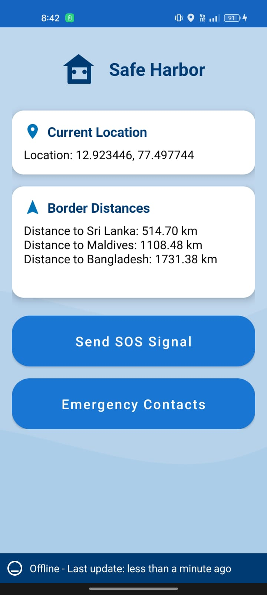

# SafeHarbor  - Every fisherman's lifeline at sea
A Maritime Alert App for Coastal Fishermen

SafeHarbor is a lightweight mobile application designed to protect small-scale fishermen from unintentionally crossing maritime borders. With offline functionality and real-time vibration alerts, the app acts as a silent guardian at sea.

---

## Problem

Small-scale fishermen often lack awareness of maritime boundaries, especially when venturing far offshore without proper navigation tools. Accidental border crossing has led to detainment, fines, and long-term distress for many.

---

## Solution

SafeHarbor uses GPS data and vibration alerts to notify fishermen when they're nearing maritime boundaries. It works offline, requires no internet or complex hardware, and is designed to be both affordable and reliable.



---

## Features

- **Offline Alerts:** Works without internet using preloaded coordinates.  
- **GPS Boundary Monitoring:** Detects proximity to international maritime borders.  
- **Vibration/Audio Warnings:** Sends real-time haptic feedback as the user nears unsafe waters.  
- **Background services:** Works in the background, tracking location and sending alerts   
- **Low-Cost Deployment:** Designed for affordability and ease of use.  

---


## To Run:

1. Clone the repository:  
   ```bash
   git clone https://github.com/Gagana09/SafeHarbor-Every-Fisherman-s-Invisible-Lifeline.git
   ```
2. Open the repository on Android Studio.
3. Connect an Android device or Emulator.
4. Run the application.

---
